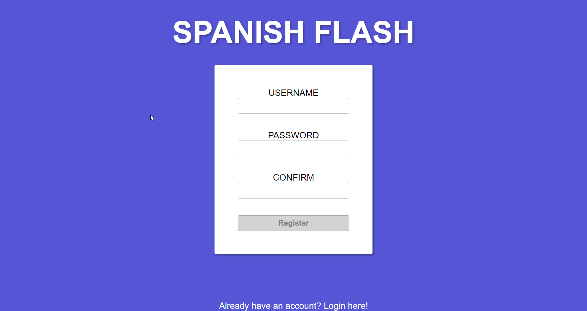
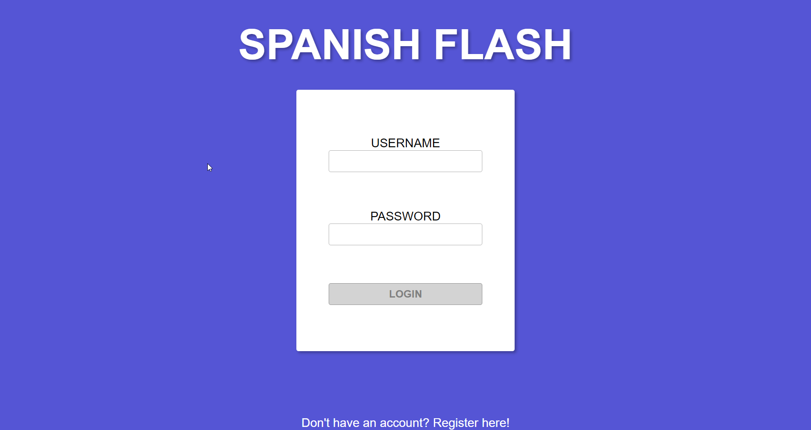
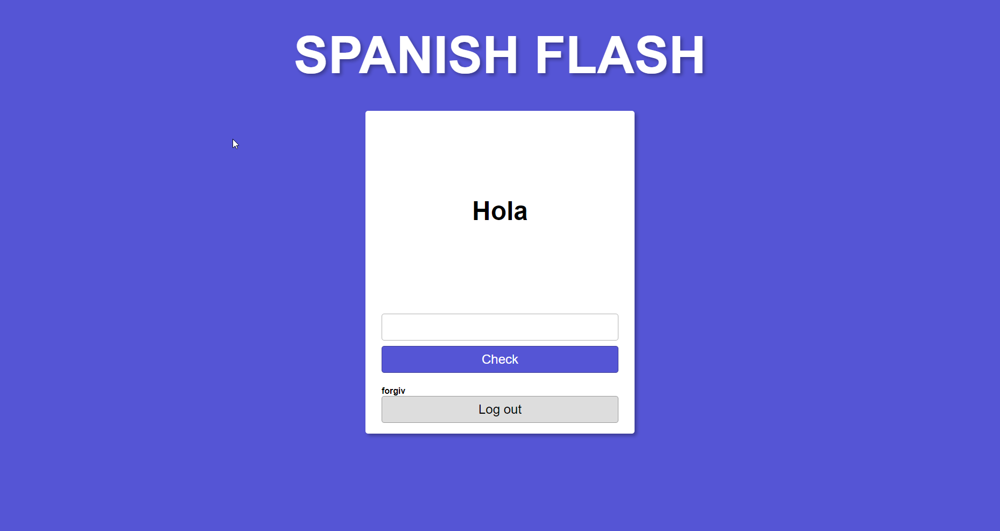
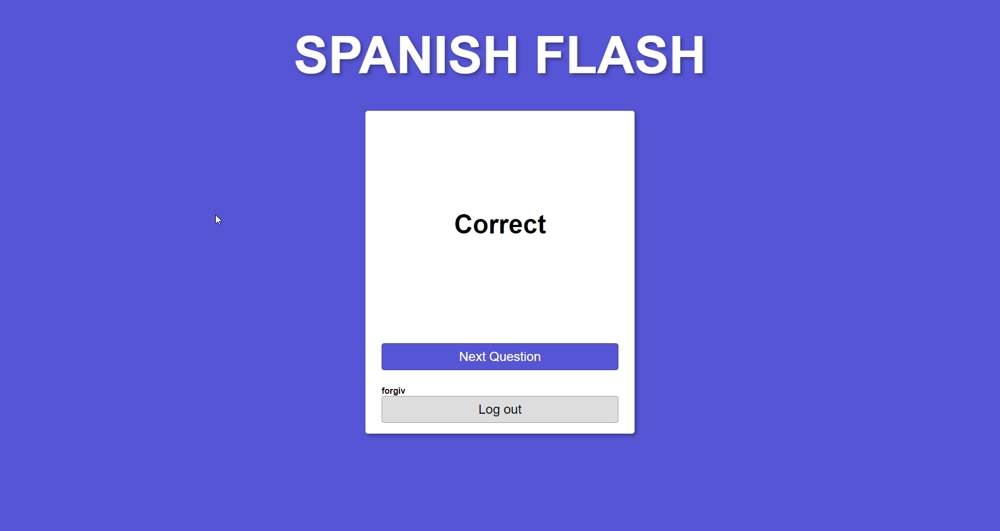

# Spanish Flash (spacedRepetition-client)

[Live Version](https://www.dameonmendoza.com/spacedRepetition-client/)

Spanish Flash is an app that uses a flash-card style approach to helping one learn Spanish.  
The technique is backed up by the spaced repetition algorithm, which is proven to help with learning and enforcing one's understanding.

This is the client side code for the application.  
Looking for the server source? That's [here](https://github.com/Dameon1/spacedRepition-server)

### Technologies Used
- React
- Redux
- React-Router
- Redux-Thunk
- Redux-Form
- JWT for authentication

### Screenshots
Registration

Login

Translate

Translated Correctly

Translated Incorrectly

## Author
- **Hiram Cruz** - *Initial work* - [forgiv](https://github.com/forgiv) (client-author)
- **Dameon Mendoza** - *Initial work* - [dameon1](https://github.com/dameon1)
(server-author)

## Contributors

- **Dameon Mendoza** - *Initial work* - [dameon1](https://github.com/dameon1)